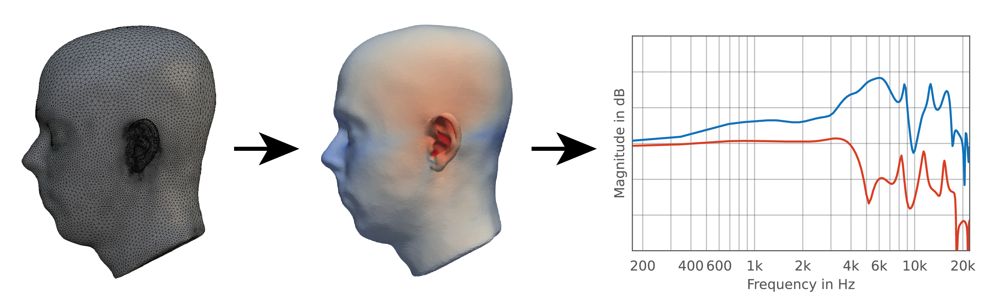

Mesh2HRTF
=========

Mesh2HRTF is an open-source project aiming at providing an easy-to-use software package for the numerical calculation of head-related transfer functions (HRTFs). It targets researchers in the field of binaural audio. In a nutshell, Mesh2HRTF consists of three parts:

- Mesh2Input: prepare the 3D head (and torso) mesh and the acoustic parameters (source position, acoustic materials),
- NumCalc: calculates the sound pressure on the 3D mesh and at user specified position around it
- Output2HRTFs: processes the output from NumCalc to HRTFs saved in the SOFA format.

Before starting to use Mesh2HRTF we recommend the following background information to obtain the best possible results

- [1]_ gives a general introduction into Mesh2HRTF as a whole.
- [2]_ and [3]_ detail the required mesh quality.
- [2]_ gives information about possible source/microphone models.
- [4]_ and [5]_ introduce mesh grading strategies to reduce the RAM requirements and computation time of the numerical HRTF calculation.
- [6]_ gives background information on the wave based numerical solver NumCalc that is used to calculate the HRTFs.
- [7]_ first introduces Mesh2HRTF as a whole.

Documentation
=============

We recommend to go through the installation steps and Tutorials below to get familiar with Mesh2HRTF before using it for your own projects. This will help you to understand the workflow and verify your first results.

Installation
    https://github.com/Any2HRTF/Mesh2HRTF/wiki/Installation

General Tutorials
    https://github.com/Any2HRTF/Mesh2HRTF/wiki/Tutorials

Complete Documentation
    https://github.com/Any2HRTF/Mesh2HRTF/wiki

Releases and Development
========================

Releases are available at https://github.com/Any2HRTF/Mesh2HRTF/releases.

The ``master`` branch contains the latest stable code basis and is available for cloning, forking, or downloads.

The ``develop`` branch contains the latest stable developer version. Other branches track the more recent development, which might be unstable. If you would like to contribute to Mesh2HRTF please check `here <https://github.com/Any2HRTF/Mesh2HRTF/blob/develop/CONTRIBUTING.rst>`_.

References
==========

.. [1] F\. Brinkmann, W. Kreuzer, J. Thomsen, S. Dombrovskis, K. Pollack, S. Weinzierl, and P. Majdak, ''Recent Advances in an Open Software for Numerical HRTF Calculation,'' J. Audio Eng. Soc. (in print), 2023.

.. [2] H\. Ziegelwanger, P. Majdak, and W. Kreuzer, `''Numerical calculation of listener-specific head-related transfer functions and sound localization: Microphone model and mesh discretization,'' <https://doi.org/10.1121/1.4922518>`_ J. Acoust. Soc. Am., vol. 138, no. 1, pp. 208–222, Jul. 2015, doi: 10.1121/1.4922518.

.. [3] M\. Dinakaran, F. Brinkmann, S. Harder, R. Pelzer, P. Grosche, R. R. Paulsen, and S. Weinzierl, `''Perceptually motivated analysis of numerically simulated head-related transfer functions generated by various 3D surface scanning systems,'' <https://doi.org/10.1109/ICASSP.2018.8461789>`_ in IEEE Int. Conf. Acoustics, Speech and Signal Processing (ICASSP), Calgary, Canada, Apr. 2018, pp. 551–555. doi: 10.1109/ICASSP.2018.8461789.

.. [4] T\. Palm, S. Koch, F. Brinkmann, and M. Alexa, `''Curvature-adaptive mesh grading for numerical approximation of head-related transfer functions,'' <https://www.researchgate.net/publication/356264260_Curvature-adaptive_mesh_grading_for_numerical_approximation_of_head-related_transfer_functions>`_ in Fortschritte der Akustik – DAGA 2021, Vienna, Austria, Aug. 2021, pp. 1111–1114.

.. [5] H\. Ziegelwanger, W. Kreuzer, and P. Majdak, `''A-priori mesh grading for the numerical calculation of the head-related transfer functions,'' <https://doi.org/10.1016/j.apacoust.2016.07.005>`_ Appl. Acoust., vol. 114, pp. 99–110, Dec. 2016, doi: 10.1016/j.apacoust.2016.07.005.

.. [6] W\. Kreuzer, K. Pollack, P. Majdak, and F. Brinkmann, `''Mesh2HRTF / NumCalc: An Open-Source Project to Calculate HRTFs and wave scattering in 3D,'' <https://www.conforg.fr/erbnam2022/output_directory/data/articles/000042.pdf>`_ in Euroregio BNAM 2022, Aalborg, Denmark, May 2022.

.. [7] H\. Ziegelwanger, W. Kreuzer, and P. Majdak, `''Mesh2HRTF: An open-source software package for the numerical calculation of head-related transfer functions,'' <https://www.researchgate.net/publication/280007918_MESH2HRTF_AN_OPEN-SOURCE_SOFTWARE_PACKAGE_FOR_THE_NUMERICAL_CALCULATION_OF_HEAD-RELATED_TRANFER_FUNCTIONS>`_ Florence, Italy, Jul. 2015.
